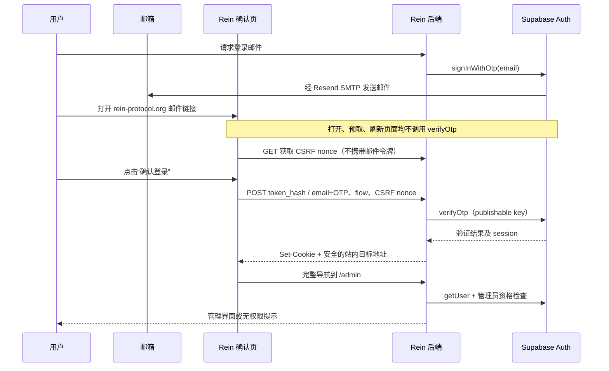

# Auth 邮件站内验证技术设计

状态：本地实现完成，验证结果见下方实施记录；尚未部署或修改线上配置。

日期：2026-10-08

范围：Rein Protocol Foundation 网站与 Supabase Auth 邮件。

## 1. 决策与目标

将 Supabase Auth 邮件中的验证入口改为 `https://rein-protocol.org/auth/confirm`。用户打开站内页面后，明确点击确认按钮；网站后端调用 Supabase `auth.verifyOtp`，再把会话写入当前浏览器的 Cookie。

首期覆盖当前实际使用的管理员 Magic Link 和首次登录时的邮箱确认，同时提供手输邮件 OTP 的备用方式。保留 `noreply@rein-protocol.org`、现有 Resend SMTP 和 Supabase 项目 API 地址。此方案使用网站现有域名，不依赖 Supabase Custom Domain，也不需要为本方案升级套餐。

预期收益是邮件行动链接与网站品牌一致、减少用户可见的跨域跳转，并避免仅执行 GET 的邮件扫描器提前消耗一次性令牌。**不能据此保证进入 Inbox**：SPF、DKIM、DMARC、发送信誉、退信与投诉仍需要独立核查；不能将首次站内访问率等同于收件箱触达率。

Supabase 支持使用模板中的 `TokenHash` 构建自定义验证入口；数字 OTP 是另一种验证凭证。两者在后端均可调用 [`verifyOtp`](https://supabase.com/docs/reference/javascript/auth-verifyotp)，但请求参数不同。

## 2. 当前实现与边界

| 位置 | 当前行为 | 本设计的影响 |
| --- | --- | --- |
| `app/admin/login/actions.ts` | 生产调用 `signInWithOtp`，回调地址是 `/auth/callback?next=/admin`；发送前检查管理员资格 | 保留发送入口和资格检查，补充发送限流；兼容旧回调 |
| `app/auth/callback/route.ts` | GET 中用 `exchangeCodeForSession(code)` 交换 PKCE code | 保留，处理切换前已发出的邮件及未来 OAuth 回调 |
| `lib/supabase/server.ts` | `@supabase/ssr` 使用 Cookie 保存会话 | 验证接口复用 SSR 模式，确保写入错误不会被静默忽略 |
| `proxy.ts` | `/auth/*`、`/admin/*` 刷新会话 | 新确认页必须无副作用地展示；新 API 的 Cookie 和缓存策略需单独配置 |
| `lib/admin/auth.ts` | `getUser()` 后检查环境 allowlist 或有效 `admin_users` 记录 | 保留；验证邮箱不能直接授予管理员权限 |
| `lib/supabase-auth-email.ts`、`supabase/templates/*.html` | 五类链接邮件使用 `ConfirmationURL`；reauthentication 显示 `Token` | 首期只替换 confirmation、magic_link 的入口，保留其余模板 |
| `app/api/contributor/verify/route.ts` | GET 调用自建 `verify_contributor_application` RPC，并安排后续业务邮件 | 独立流程；不能直接改用 Supabase Auth `verifyOtp` |

Contributor 申请验证证明申请邮箱的控制权，不代表创建 Auth 用户或授予管理员资格。Welcome 邮件没有 Auth 验证动作。本设计不会自动迁移这两类业务邮件；Contributor 后续应单独设计为“站内展示 + POST 调用现有 RPC”，并处理业务邮件发送的幂等性。

当前开发环境的直接管理员登录是另一条受环境条件限制的路径；保留其现有限制，不把 `admin.generateLink` 引入生产验证接口。

## 3. 用户流程



确认页显示动作、一次性凭证说明和确认按钮，不自动提交。登录动作提示“继续后将使用这封邮件对应的账户登录”；已有会话时提示可能切换账户，不能静默替换。不要在验证前声称邮箱身份已确认。

## 4. 链接与凭证传递

### 4.1 推荐链接：令牌放在 URL fragment

```text
https://rein-protocol.org/auth/confirm#token_hash=<TokenHash>&flow=admin-signin
```

Magic Link 模板示意：

```html
<a href="{{ .SiteURL }}/auth/confirm#token_hash={{ .TokenHash }}&amp;flow=admin-signin">
  Continue to sign in
</a>
<p>Alternatively, enter the verification code from this email on our website:</p>
<p>{{ .Token }}</p>
```

confirmation 模板使用 `flow=confirm-email`。按钮与复制链接使用同一入口；数字验证码之外提供不含凭证的 `{{ .SiteURL }}/auth/confirm` 备用入口。

浏览器不会把 fragment 发送给网站的 HTTP GET，因此邮件令牌不会随页面请求进入网站的 URL 访问日志。页面的最小客户端组件读取 fragment，校验字段结构，将令牌放在当前组件内存，随即使用 `history.replaceState` 去掉地址栏中的 fragment。**此时只解析凭证，不调用验证接口。**

凭证不进入 localStorage、sessionStorage、全局状态、错误报告或分析事件。刷新清理后的页面会丢失内存中的令牌：用户可重新打开原邮件链接，或输入 OTP。多标签页各自持有凭证，避免共享 pending-token Cookie 互相覆盖。

这是本项目对官方自定义链接方式的安全取舍：fragment 降低网站日志暴露，但需要 JavaScript，且须验证邮件客户端和 Safe Links 重写后的兼容性。邮件服务商仍能读取原邮件链接，fragment 不对它们保密。

首期不接受 query 中的 `token_hash`，也不接受嵌套 `ConfirmationURL`。如果 fragment 被客户端丢弃，显示 OTP 表单；禁用 JavaScript 时给出明确说明。不会自动退回容易把凭证带入访问日志的 query 链接。

### 4.2 TokenHash 与数字 OTP 的区别

| 模式 | 用户操作 | 后端参数 |
| --- | --- | --- |
| 邮件链接 | 点击站内确认按钮 | `{ token_hash, type: 'email' }` |
| 手输 OTP | 输入邮箱与邮件中的验证码 | `{ email, token, type: 'email' }` |

首期 confirmation 与 magic_link 使用 `type: 'email'`，与当前 SDK 示例及项目开发登录的调用一致。不得将模板名称 `magic_link` 直接当作 API 类型；数字验证码不能填入 `token_hash`。

`TokenHash` 虽有 “Hash” 名称，仍是可兑换会话的 bearer secret，按密码级凭证处理。数字 OTP 的长度与过期时间以当前项目配置为准，文案不固定写六位或自行延长有效期。

## 5. 接口与服务端验证

### 5.1 路由约定

| 路由 | 方法 | 职责 |
| --- | --- | --- |
| `/auth/confirm` | GET / HEAD | 展示确认页或 OTP 表单；不消费凭证、不发邮件 |
| `/api/auth/verify` | GET | 创建短期 CSRF nonce，返回页面使用的值；不消费凭证 |
| `/api/auth/verify` | POST | 校验请求、限流、调用 `verifyOtp`、设置会话 Cookie |
| `/auth/confirmed` | GET | 展示邮箱确认结果及进入登录入口的按钮；不凭 URL 参数宣称已验证 |
| `/auth/callback` | GET | 保留旧 PKCE code 交换逻辑 |

Next.js 的同一路径不能同时存在 `page.tsx` 与 `route.ts`，因此页面和验证 API 使用不同路径。Cookie 写入发生在 Route Handler 内，不能在 Server Component 渲染时完成。

### 5.2 POST 请求

```ts
type VerificationRequest =
  | { mode: 'link'; flow: 'admin-signin' | 'confirm-email'; token_hash: string; csrf: string }
  | { mode: 'otp'; flow: 'admin-signin' | 'confirm-email'; email: string; token: string; csrf: string }
```

服务端严格校验枚举和互斥字段；限制请求体为 4 KiB、令牌字段为 512 字符、邮箱为 320 字符，OTP 按已核查的配置验证格式。拒绝重复字段、任意 `type`、任意 Supabase URL 和 `next` / `redirect_to`。邮箱规范化复用项目 helper。

后端步骤：

1. 检查请求来源、CSRF nonce、JSON Content-Type 与字段；失败时不调用 Supabase。
2. 执行共享数据库限流，限流服务异常时返回可重试的 503。
3. 使用固定 `publicEnv.supabaseUrl` 和 publishable key 创建本次请求专用 SSR client。
4. 调用 `verifyOtp`，由 Supabase 判断令牌真实性、有效期和是否已使用。
5. 首期成功必须拿到 `data.session` 和对应用户；缺少会话不能当成成功登录。
6. 根据验证后的用户身份和服务端 flow 策略确定结果。管理员登录仍需资格检查；不能相信用户填写的邮箱或请求里的 flow 来授权。
7. 将 SSR client 产生的全部 Cookie（包含分块 Cookie）附加到最终响应；返回固定站内目标地址，客户端使用完整导航进入目标页。

示意代码只表达调用关系，省略校验、限流和 Cookie adapter：

```ts
const params = input.mode === 'link'
  ? { token_hash: input.token_hash, type: 'email' as const }
  : { email: normalizeEmail(input.email), token: input.token, type: 'email' as const }

const { data, error } = await requestScopedSupabase.auth.verifyOtp(params)
// 分类错误；确认 session；检查授权；把全部 Set-Cookie 写入最终响应。
// 不把 access_token / refresh_token 放进 JSON 或跳转 URL。
```

当前 `createSupabaseServerClient` 的 `setAll` 为兼容 Server Components 会捕获 Cookie 写入异常；验证接口应增加明确可写的 adapter 或专用构造函数，避免出现“验证成功但没有登录 Cookie”。遵循 `@supabase/ssr` 的 Cookie 格式，不假定把所有会话 Cookie 改成 HttpOnly 仍与现有客户端兼容。

`admin-signin` 成功目标固定 `/admin`，无资格则显示无权限结果；`confirm-email` 目标固定 `/auth/confirmed`，提供登录入口。服务端保护页面继续执行 `requireAdmin()`。改变 flow 只能改变展示/跳转，不增加任何权限。

### 5.3 响应与错误

| 结果 | 响应 | 页面行为 |
| --- | --- | --- |
| 验证成功 | 200 `{ status: 'verified', destination }`，携带会话 Cookie | 清除内存凭证，完整导航 |
| 输入错误 | 400 `invalid_request` | 指出需要检查的输入，不回显令牌 |
| 过期、已使用、无效令牌 | 400 `invalid_or_expired` | 通用提示，提供重新请求入口 |
| 来源或 CSRF 校验失败 | 403 `request_rejected` | 重新加载确认页 |
| 身份已验证但无管理员资格 | 403 `not_authorized` | 无权限提示，不以此授予权限 |
| 限流 | 429 `rate_limited`，`Retry-After` | 显示稍后重试 |
| 上游故障或结果不确定 | 503 `temporarily_unavailable` | 提示检查会话或重新请求邮件 |

不透传 Supabase 的原始响应体、账号存在性细节或原始异常。区分验证失败与验证后授权失败；无权限结果不应错误地提示令牌过期。

## 6. 安全与运行约束

### 6.1 CSRF、会话和跳转

GET nonce 接口设置随机值的 host-only、HttpOnly、Secure、SameSite=Lax Cookie（本地 HTTP 开发单独配置），有效期建议 10 分钟；响应中的同值由页面保存在内存并随 POST 提交。POST 比较 nonce，并要求 `Origin` 等于服务端配置的站点 origin；拒绝缺失或跨域 Origin，不使用任意 Host header 构造信任源，不开放 CORS。nonce 不承担邮件身份验证职责。

CSRF Cookie 不在每次 GET 时无条件轮换，以免多标签页相互失效；过期时页面可重新获取 nonce。SameSite 与来源校验不能阻止用户主动打开攻击者转发的合法登录链接，因此按钮必须明确说明账户切换行为，不能宣称完全消除登录 CSRF。

验证凭证一次性失效由 Supabase 管理。不要用 service/secret key 将邮箱直接标记为 confirmed，也不要根据用户可编辑 metadata 授权。服务端限流 RPC 可使用现有 secret client，但这与 Auth 验证所用 publishable client 分离。

### 6.2 缓存与泄露防护

- 确认页、nonce API、POST 响应与错误页均设置 `Cache-Control: private, no-store`，确认页设置 `Referrer-Policy: no-referrer`、`X-Robots-Tag: noindex, nofollow` 与禁止嵌入策略。
- 确认页不加载广告、第三方 analytics、session replay 或第三方脚本；检查根布局及未来全站脚本不会先行读取 fragment。使用与 Next 运行时兼容的 CSP，限制表单与连接目标。
- 应用、代理、APM 不记录请求体、Cookie、fragment、OTP、完整邮件链接或 Supabase session；日志只记录动作、结果类别、耗时和随机 request ID。
- 页面不得把令牌插入 `href`、外部图片 URL、错误字符串或 React 服务端渲染结果；只能通过 HTTPS POST 提交给本站验证 API。
- 邮件点击/打开追踪保持关闭；真实邮箱测试核查链接没有被发送服务重写。

### 6.3 限流与重试

复用数据库原子计数 RPC `consume_form_rate_limit`，提取通用服务端 helper；现有 helper 位于 `lib/community/actions.ts` 内，不能直接当成已公开的通用接口。现有 RPC 的 identifier 类型只有 `ip`、`email_hash`，首期无需新增 token identifier 或迁移 schema。

建议初始配置：验证 POST 每 IP 每 10 分钟 30 次；数字 OTP 额外每邮箱每 10 分钟 5 次；请求登录邮件每 IP 每小时 10 次、每邮箱每小时 3 次。使用独立 scope，邮箱使用带 scope 的 hash，不储存明文。部署前核对可信代理 IP 提取方式，避免可伪造 forwarded header 绕过限制；共享出口用户遇到限制时允许后续调参。

发送入口无论账号是否有权限都使用统一提示，禁止确认页在 GET 或渲染时重发邮件。现有 Supabase 发送冷却、OTP 有效期、验证限流和 CAPTCHA 配置保持有效，并核查后端代理请求在上游 IP 限流中的表现。

前端提交时禁用按钮，不后台自动重试 `verifyOtp`。两个页面同时使用同一令牌时，Supabase 一次性语义只允许成功使用；另一页给出通用结果。在响应丢失或超时后，不能将“重复调用失败”自动视为第一次成功：检查当前浏览器已验证的会话，无法确定时允许请求新邮件。首期不建设令牌/会话结果缓存。

仅打开链接不会消费凭证；能执行脚本或提交表单的高级扫描器仍可能消费它。数字 OTP 是补充防护，不能把二次点击当作机器人识别机制。

## 7. 其他 Auth 邮件的后续扩展

| 模板 | 后续 API 类型 | 必须具备的产品流程 |
| --- | --- | --- |
| `invite` | `invite` | 验证后进入邀请 onboarding；邀请不自动赋予管理员权限 |
| `recovery` | `recovery` | 验证后进入设置新密码页面，调用 `updateUser({ password })`；增加会话与恢复流程保护 |
| `email_change` | `email_change` | 保留 `NewEmail`；区分单侧确认与实际修改完成，不假设每次成功都有新 session |
| `reauthentication` | 不走本设计的 link verify 分支 | 保留数字 nonce；按 `reauthenticate()` → `updateUser({ password, nonce })` 处理 |

首期代码不接受上述 flow。仓库尚无相应完整页面，所以它们的模板继续使用现有入口；只有对应页面、授权约束和测试完成后才能切换。特别是 secure email change 可能要求旧邮箱和新邮箱分别确认；必须维持当前安全设置并用真实配置验证。

恢复会话本身可能是正常 Auth 会话；“只允许进入恢复页”不能仅依赖前端跳转。若未来需要严格的恢复期间访问限制，须设计服务端状态/授权检查，不能声称 Supabase 自动提供受限 session。

## 8. 预计文件变更

| 文件 | 实施内容 |
| --- | --- |
| 新 `app/auth/confirm/page.tsx`、客户端表单组件 | 安全页面、fragment 解析、主动确认、OTP 备用入口及错误状态 |
| 新 `app/api/auth/verify/route.ts` | nonce GET、验证 POST、来源检查和 Cookie 响应 |
| 新 `app/auth/confirmed/page.tsx` | 读取已验证用户状态并展示结果 |
| 新 `lib/auth/email-verification.ts` | 输入 schema、flow 映射、错误分类、固定跳转策略 |
| `lib/supabase/server.ts` 或新服务端 adapter | 支持验证请求可靠写入 Cookie，不破坏现有 Server Component 使用 |
| 新通用服务端 rate-limit helper | 复用既有 RPC，区分发送与验证 scope |
| `app/admin/login/actions.ts` | 保留资格检查，增加发送限流和备用 OTP 入口说明 |
| `lib/supabase-auth-email.ts` | 只改两类模板入口与备用验证码文案 |
| `supabase/templates/confirmation.html`、`magic_link.html` | 由现有脚本生成 |
| `docs/outreach/email-templates.html` / `docs/outreach/supabase-auth-email.md` | 同步预览与站内验证说明，纠正必须始终使用 `ConfirmationURL` 的旧指导 |
| `next.config.ts`、`proxy.ts`（如需要） | 安全响应头与 Cookie 刷新兼容检查 |
| 相关单元与浏览器测试 | 覆盖安全边界、Cookie 持久化、首次登录与旧链接兼容 |

不需要新 DNS 记录、自定义 Supabase API 域名或自建邮箱验证数据库；首期限流复用现有表。实施时保留仓库中已有的未提交改动。

## 9. 上线与回滚

1. 本地实现路由和模板，生成 HTML 与可审阅预览，完成测试；此阶段不改 hosted 配置。
2. 先部署支持新旧两种入口的网站，确认生产路由、安全头及 Cookie 可写。
3. 备份并读取 hosted Auth 设置，核对 Site URL 是 `https://rein-protocol.org`、SMTP 发件人与模板变量。仅在测试发送获得授权后向指定测试邮箱发送邮件。
4. 先切换 confirmation / magic_link 的模板字段；不要用 `supabase config push` 覆盖 hosted Site URL、redirect allowlist、SMTP、安全设置、有效期和限流。
5. 从 hosted 配置读回两类模板，核查实际链接；用首次授权账户及既有账户完成端到端验证，保留旧 `/auth/callback`。
6. 观察验证成功率、无效链接、429/503、退信与指定测试邮箱位置。分开评估验证可靠性和投递效果。

回滚时恢复这两类旧模板，新页面和验证 API 保留至已发送新邮件的有效期结束并留出缓冲；旧 callback 持续保留。更新模板不会改变已经发出的邮件内容，因此不能立即删除新路由。不要通过回滚停用安全确认、重置账号或强行确认邮箱。

## 10. 验收标准

- 首次账户 confirmation 和既有账户 magic_link 均可在同浏览器及另一设备打开，在主动提交后建立会话；无需原浏览器的 PKCE verifier。
- GET、HEAD、链接预取、JS hydration 均不调用 `verifyOtp`，不发送后续邮件；测试用调用计数明确断言。
- 浏览器地址在解析后不含凭证；GET 网络请求、前端错误上报和服务端日志不含凭证。关闭 JS、fragment 丢失、刷新、多标签页有可理解的恢复路径。
- 数字 OTP 备用入口验证真实邮件中的验证码；错误邮箱、错误码、重复使用和过期都不能建立新会话。
- 跨域/缺失 Origin、错误 CSRF、非法 flow、超大请求和任意跳转输入在调用 Supabase 前被拒绝。
- SSR Cookie 在最终响应完整保存；进入 `/admin` 后能通过 `getUser`，未授权用户不能访问管理数据。
- 并发双击、双标签页、网络超时与上游限流有明确结果，不进行无界重试。
- 切换前发出的旧邮件仍可通过 `/auth/callback` 登录；开发直接登录仍受原环境条件限制。
- HTML 生成检查、相关 Vitest、typecheck、lint 与实际 Cookie 导航的 Playwright 测试通过。mock 成功不替代真实 Auth/SMTP 验证。
- 在 Gmail、Outlook、Apple Mail 中检查原始和复制链接、Safe Links 行为及移动端可用性。测试发送仅针对授权地址；收件箱改善需真实观察，不以设计验收承诺。

## 11. 依据

核查依据为当前仓库实现、已安装的 Supabase Auth 类型与 `verifyOtp` 实现、Next.js 安装包内 Route Handlers / cookies 指南，以及以下官方文档。上线时应再次核对有效期、安全配置和 SDK 版本。

- [Supabase 邮件模板](https://supabase.com/docs/guides/auth/auth-email-templates)：模板变量、链接扫描问题与自定义验证入口。
- [verifyOtp](https://supabase.com/docs/reference/javascript/auth-verifyotp)：TokenHash 与数字 OTP 的调用方式。
- [Passwordless email sign-in](https://supabase.com/docs/guides/auth/auth-email-passwordless)：邮件登录与服务端验证流程。
- [SSR client](https://supabase.com/docs/guides/auth/server-side/creating-a-client?queryGroups=framework&framework=nextjs)：请求级 client 和 Cookie 会话。
- [reauthenticate](https://supabase.com/docs/reference/javascript/auth-reauthenticate)、[updateUser](https://supabase.com/docs/reference/javascript/auth-updateuser)：nonce 与用户属性更新。
- [Custom Domains](https://supabase.com/docs/guides/platform/custom-domains)：Supabase API 自定义域名是独立平台功能，本设计不使用它。


## 12. 实施记录（2026-10-08）

已实现确认页、nonce GET / 验证 POST、真实会话确认结果页、请求级 Cookie adapter、
严格输入校验和共享限流 helper。确认页只读取 Cookie 是否存在来显示账户切换提示，
不会在 GET 中调用 Auth 或刷新会话；该提示不承担身份或授权检查。结果页通过 `getUser`
读取可信用户状态。旧 callback 与受环境限制的开发直接登录保留。

confirmation / magic_link 的本地模板和可审阅预览已更新；其余模板不变。管理员发送入口
在资格检查前执行共享限流，并对发送失败使用统一回复。管理员验证授权依据用户 ID
对应的有效记录或环境 allowlist，不能仅凭 POST 中的邮箱授权。

本地 OTP 配置为 8 位；新增 `AUTH_EMAIL_OTP_LENGTH` 必须与 hosted 的
`mailer_otp_length` 一致。限流采用现有 RPC 的固定 UTC 时间窗。Vercel 上只使用
`x-vercel-forwarded-for`；其他运行环境默认共享 unknown IP 桶，另行提供可信 ingress
adapter 后才能细分 IP。生产构建的本地 HTTP 测试需显式设置
`AUTH_ALLOW_LOCAL_HTTP=1`，Vercel 不允许此例外。

生成脚本同时维护 `docs/outreach/supabase-auth-email-preview.html`。
独立 `playwright.auth.config.ts` 在本地 Supabase 与 Mailpit 上验证真实令牌、OTP、
Cookie 和页面导航，禁止 hosted 目标，关闭可能保存凭证的 Auth traces。

上线步骤仍须按第 9 节执行。真实 Gmail / Outlook / Apple Mail、Safe Links、hosted
Resend 投递和收件位置观察尚未执行，不能从本地验收推断邮件投递改善。

### 本地验证结果

- Vitest：基于最新 main 回归，25 个测试文件、265 项测试通过。
- TypeScript typecheck、oxlint、生成模板/预览一致性检查与 diff 空白检查通过。
- 独立 Playwright：基于最新 main 回归，桌面与移动端共 20 个场景在完整运行中全部通过。
- Playwright 使用生产构建与真实本地 Supabase Auth，验证无 PKCE 的邮件凭证兑换、
  数字 OTP、一次性语义、Cookie 导航、管理员授权、双标签页、fragment 重开/刷新、
  无 JavaScript 提示、并发提交、429 与响应不确定时的恢复路径。
- 首次账户通过 Supabase SMTP 投递到本地 Mailpit，提取真实邮件凭证后在另一浏览器
  主动确认。现有本地 SMTP 模板仍可使用旧 ConfirmationURL；此测试提取凭证后
  构造新 fragment 入口，并未修改运行中的本地或 hosted Auth 模板设置。
  新邮件 HTML 的 fragment、OTP 和复制链接由模板测试及生成一致性检查覆盖。
